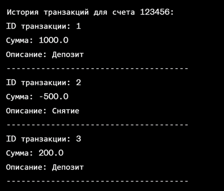

# Java_Lab2_1
* Создайте класс Student, который будет представлять студента. Класс должен иметь следующие атрибуты (поля): имя, возраст и средний балл. Затем создайте объект этого класса и установите значения для атрибутов, после чего выведите информацию о студенте на экран.
* Создать класс BankAccount с внутренним классом Transaction для учета банковских транзакций. Класс BankAccount должен иметь свойства accountNumber и balance. Он также должен иметь методы addTransaction() для добавления транзакции и printStatement() для вывода истории транзакций. Класс Transaction должен иметь свойства transactionId, amount и description. На консоль в результате выполнения программы должна быть выведена следующая информация:

